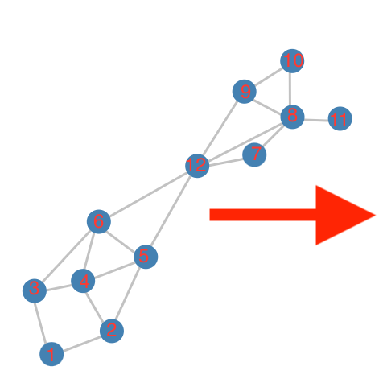
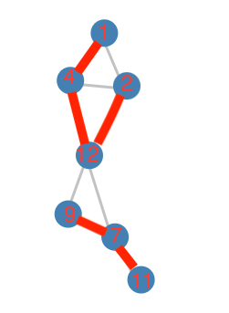
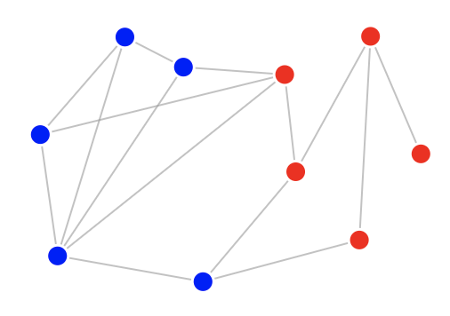
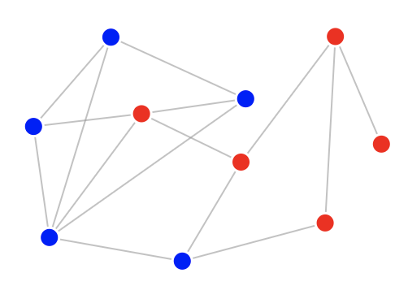

# Overview

This repository implements **Multilevel Graph Partition** algorithm proposed in [Multilevel Graph Partitioning Schemes](https://www.researchgate.net/publication/221085380_Multilevel_Graph_Partitioning_Schemes)

**Three steps of Multilevel Graph Partition:** 
1. Coarsening
2. Partitioning
3. Uncoarsening

**Coarsening can be obtained by followings:**
- Matching
- Max-matching
    - Random matching **__this one is selected by my approach__**
        - Heavy Edge Matching(HEM)
        - Light Edge Matching(LEM)
    - Heavy Clique Matching(HCM)

**Partition step can be achieved by one of followings:**
- Spectral Bisection(SB) 
- geometric bisection 
- combinatorial methods
- Graph Growing Algorithm(GGP) **__this one is selected by my approach__**
    1. randomly select a vertex v
    2. grow a region around v in breath-first strategy until half of vertex-weight included
- Greedy Graph Growing Algorithm(GGGP)

**Uncoarsen step can be achieved by one of followings:**
- Kernighan-Lin(KL) **__this one is selected by my approach__**
- Greedy Refinement
- Boundary Refinement

--- -- - - --

**Coarsen example, red line for edge merged from multiple edges**

  

**Uncoarsen example, relocate red/blue node into the other group**

  

